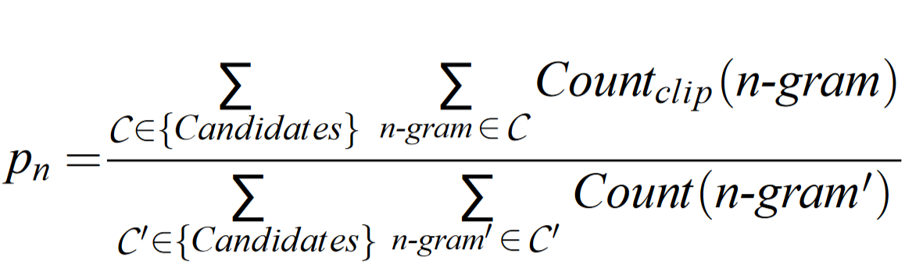
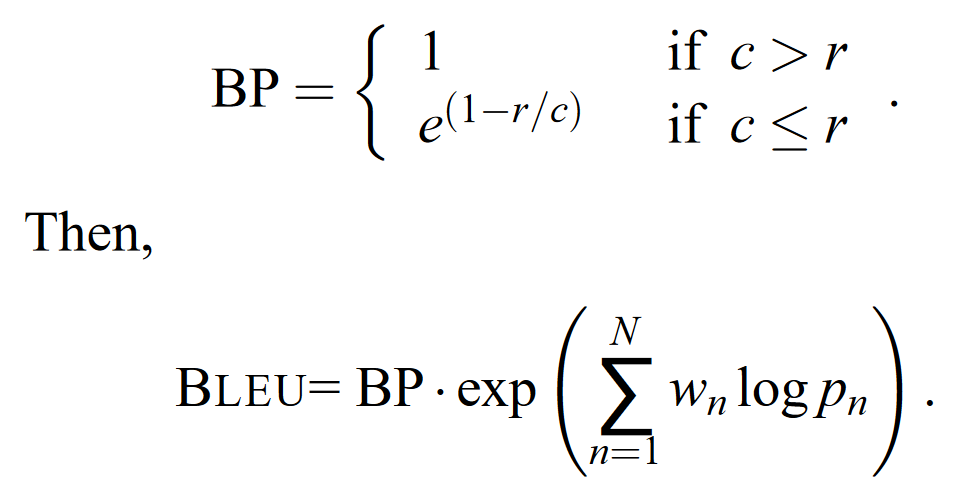

### __1.2. BLEU Score__

Bilingual Evaluation Understudy Score hay ngắn gọn là BLEU score là một thang điểm được dùng phổ biến trong đánh giá MT. BLEU được Kishore Papineni và cộng sự đề xuất lần đầu vào năm 2002 qua bài nghiên cứu "a Method for Automatic Evaluation of Machine Translation".

BLEU được tính dựa trên số lượng n-grams giống nhau giữa câu dịch của mô hình (output) với các câu tham chiếu tương ứng (label) có xét tới yếu tố độ dài của câu.

Số n-grams tối đa của BLEU là không giới hạn, nhưng vì xét về ý nghĩa, cụm từ quá dài thường không có nhiều ý nghĩa, và nghiên cứu cũng đã cho thấy là với 4-gram, điểm số BLEU trung bình cho khả năng dịch thuật của con người cũng đã giảm khá nhiều nên n-grams tối đa thường được sử dụng là 4-gram.

Xét bộ câu dịch và tham chiếu có cùng độ dài như sau:

* Output: Đây là cái ghế
* Label 1: Đây là cái bàn
* Label 2: Kia có cái ghế

| 1-gram | Output | Label 1 | Label 2 |
|--------|--------|---------|---------|
| Đây    | 1 | 1 | 0 |
| là     | 1 | 1 | 0 |
| cái    | 1 | 1 | 1 |
| ghế    | 1 | 0 | 1 |

BLEU độc lập 1-gram:

* 1-gram và Label 1: __3/4__ = 0.75
* 1-gram và Label 2: __2/4__ = 0.5
* 1-gram và Label 1 + 2: __4/4__ = 1

| 2-grams | Output | Label 1 | Label 2 |
|---------|--------|---------|---------|
| Đây là  | 1 | 1 | 0 |
| là cái  | 1 | 1 | 0 |
| cái ghế | 1 | 0 | 1 |

Tương tự, BLEU độc lập cho 2-gram sẽ được tính như sau:

* 2-grams và Label 1: __2/3__ = 0.67
* 2-grams và Label 2: __1/3__ = 0.33
* 2-grams và Label 1 + 2: __3/3__ = 1

Công thức tổng quát độ chính xác cho mỗi n-grams:

 
Hình 3. Độ chính xác của n-gram.

Với cách tính này, thì sẽ dễ dàng thấy rằng nếu output càng ngắn, thì độ chính xác được tính theo công thức sẽ càng cao.
Ví dụ với cùng 2 Label trên, nếu output chỉ ra duy nhất chữ __"cái"__ thì BLEU sẽ bằng 1.
Lúc này, để hạn chế việc câu quá ngắn thì BP (brevity penalty) được sử dụng để so sánh độ dài output __c__ và độ dài câu tham chiếu __r__. Công thức tổng quát cho BLEU score lúc này sẽ là:

Công thức tổng quát độ chính xác cho mỗi n-grams:

 
Hình 4. BLEU score.

Quay lại ví dụ ban đầu, BLEU chung cho cả 1-gram và 2-gram với trọng số __*wn*__ ngang nhau $\tfrac {1}{2}$ sẽ là :

* 1-gram + 2-grams và Label 1:
  
    $\LARGE{e^{(0.5 \times log\tfrac {3}{4}+0.5 \times log\tfrac {2}{3})}} = 0.71$

* 1-gram + 2-grams và Label 2:
  
  $\LARGE{e^{(0.5 \times log\tfrac {2}{4}+0.5 \times log\tfrac {1}{3})}} = 0.41$

* 1-gram + 2-grams và Label 1 + 2:
  
  $\LARGE{e^{(0.5 \times log\tfrac {4}{4}+0.5 \times log\tfrac {3}{3})}} = 1$

Đối với trường hợp có nhiều hơn 1 Label và các Label có độ dài khác nhau thì lúc này, BP sẽ được tính theo Label nào có chênh lệch độ dài so Output là ít nhất.