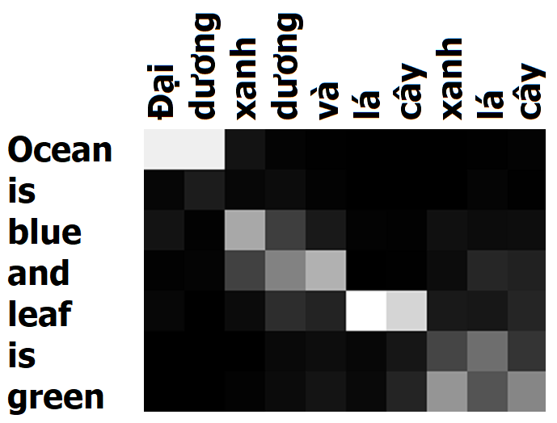
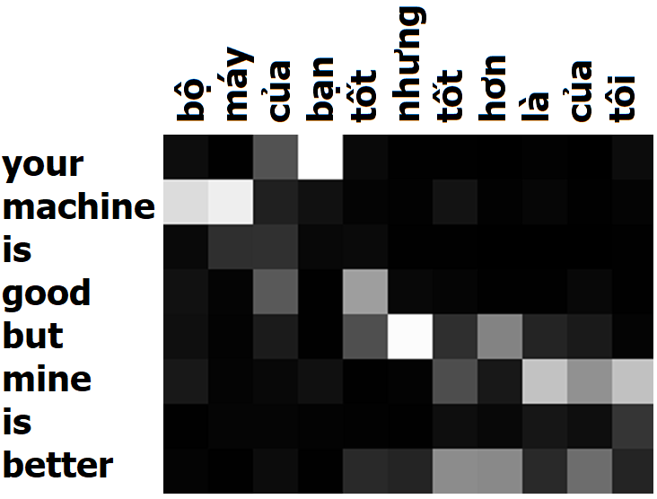
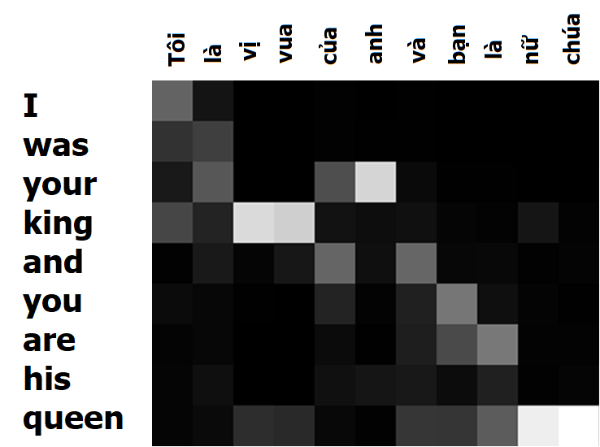
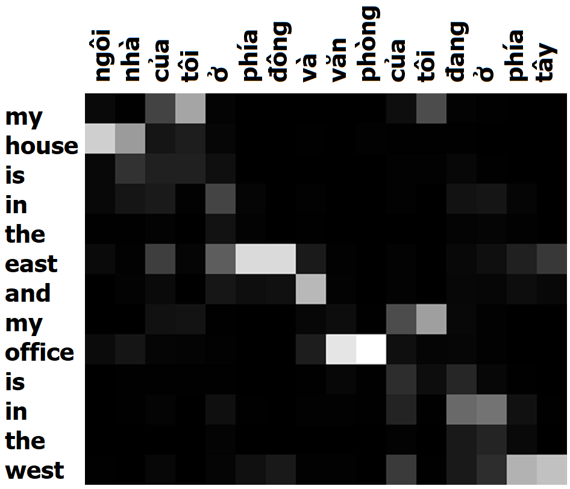
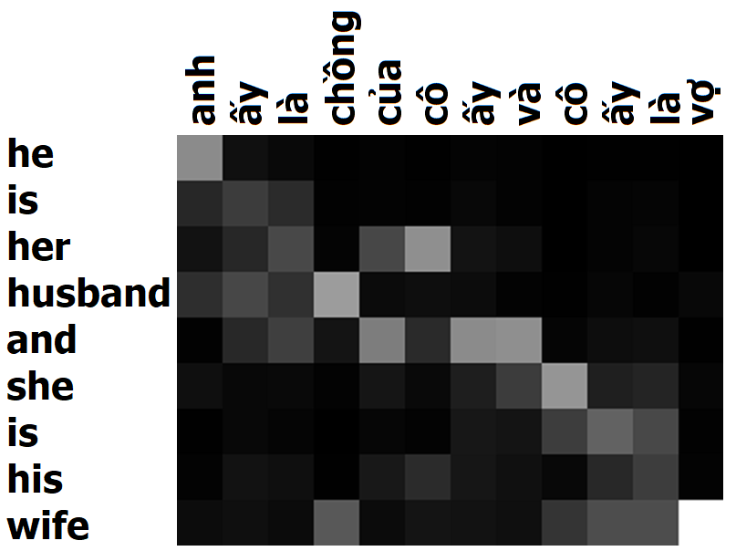

# Neural Machine Translation Overview Report

- [Neural Machine Translation Overview Report](#neural-machine-translation-overview-report)
  - [__1.Tổng quan cấu trúc NMT và BLEU score__](#1t%E1%BB%95ng-quan-c%E1%BA%A5u-tr%C3%BAc-nmt-v%C3%A0-bleu-score)
    - [__1.1. NMT__](#11-nmt)
      - [Seq2Seq](#seq2seq)
      - [Attention](#attention)
    - [__1.2. BLEU Score__](#12-bleu-score)
  - [__2. Siêu tham số__](#2-si%C3%AAu-tham-s%E1%BB%91)
    - [__2.1. Cấu trúc NN__](#21-c%E1%BA%A5u-tr%C3%BAc-nn)
    - [__2.2. Cơ chế Tối ưu hóa__](#22-c%C6%A1-ch%E1%BA%BF-t%E1%BB%91i-%C6%B0u-h%C3%B3a)
    - [__2.3. Một số tùy chỉnh khác__](#23-m%E1%BB%99t-s%E1%BB%91-t%C3%B9y-ch%E1%BB%89nh-kh%C3%A1c)
    - [__2.4. Kết quả thử nghiệm__](#24-k%E1%BA%BFt-qu%E1%BA%A3-th%E1%BB%AD-nghi%E1%BB%87m)
      - [Thông số NMT Mặc định](#th%C3%B4ng-s%E1%BB%91-nmt-m%E1%BA%B7c-%C4%91%E1%BB%8Bnh)
      - [WMT16 Mod](#wmt16-mod)
      - [IWSLT15](#iwslt15)
  - [__3. Attention matrix__](#3-attention-matrix)
    - [_Ma trận 1_](#ma-tr%E1%BA%ADn-1)
    - [_Ma trận 2_](#ma-tr%E1%BA%ADn-2)
    - [_Ma trận 3_](#ma-tr%E1%BA%ADn-3)
    - [_Ma trận 4_](#ma-tr%E1%BA%ADn-4)
  - [Another Reference](#another-reference)

## __1.Tổng quan cấu trúc NMT và BLEU score__

### __1.1. NMT__

NMT (Neural Machine Translation) là sự kết hợp của dịch máy (Machine Translation - MT) và mạng nơ-ron nhân tạo (Artificial Neural Network - NN). Và cụ thể trong bài báo cáo này thì mạng NN được sử dụng trong mô hình NMT là mạng nơ-ron hồi quy (hoặc truy hồi) (Recurrent Neural Network - RNN) và mô hình NMT được sử dụng là mô hình xây dựng theo kiến trúc NMT của Google, trên nền tảng của thư viện Tensorflow dành cho Python theo [Source code](https://github.com/tensorflow/nmt).

Khởi nguồn của MT hoạt động theo cách chia nhỏ câu thành các cụm từ và tiến hành dịch trên từng cụm từ một. Kết quả cuối cùng sẽ là một câu ghép lại từ các cụm từ đã được dịch. Cách tiếp cận này được gọi là dịch theo cụm (pharase-based), và kết quả thì không được ấn tượng lắm vì cách tiếp cận của phương pháp này không thực sự giống với cách mà con người sử dụng trong dịch thuật là đọc toàn bộ câu, nắm ý nghĩa của câu và đưa ra câu dịch tương ứng. Và NMT được xây dựng hoàn toàn dựa trên cách làm này. NMT là cách tiếp cận MT phổ biến trong khoảng 4 năm gần đây và đẫ cho ra các kết quả thực sự tốt, tới mức ngang hoặc hơn cả con người.

Cụ thể về kiến trúc thì NMT là sự kết hợp của 2 thành phân chính là __Seq2Seq__ và __Attention__

#### Seq2Seq

Kiến trúc Seq2Seq được lấy từ tên của bài nghiên cứu __Sequence to Sequence Learning with Neural Networks__ ([Sutskever et al., 2014](https://papers.nips.cc/paper/5346-sequence-to-sequence-learning-with-neural-networks.pdf)) trình bày một kiến trúc MT mà ở đó, một câu (__Seq__) sẽ được dịch bằng cách đưa vào một bộ mã hóa (__Encoder__) và nối tiếp với một bộ giải mã (__Decoder__) để dịch sang một câu (__2Seq__) ở ngôn ngữ khác.


_Hình 1. Cấu trúc Encoder-Decoder._

Cụ thể thì NMT sẽ đưa toàn bộ câu ở ngôn ngữ gốc vào Encoder để _nén_ ý nghĩa của câu thành một vector gọi là __context__ (hoặc __thought__), và đưa vector đó sang cho bộ giải mã (Decoder) để chuyển vector thành câu thuộc ngôn ngữ khác (ngôn ngữ đích) mang ý nghĩa tương ứng với câu ở ngôn ngữ gốc. Bài viết này sẽ sử dụng RNN, gated recurrent unit (GRU) hoặc Long Short-term Memory (LSTM), để làm encoder và decoder.


_Hình 2. Ví dụ cấu trúc NMT._

Ở ví dụ cấu trúc NMT trình bày ở Hình 2, bộ encoder và decoder đều được cấu tạo từ 2 lớp RNN cùng chiều, chồng lên nhau, tương ứng với màu xanh dương và màu đỏ. Ở đây, ký hiệu ```<s>``` sử dụng để báo hiệu bắt đầu quá trình decode và ký hiệu ```</s>``` sử dụng để báo hiệu cho decoder dừng quá trình decode lại.

Ngoài 2 lớp RNN chồng lên nhau ở 2 bộ encoder và decoder thì trong Hình 2 còn có sự xuất hiện của 3 lớp NN khác là:

- 1 lớp embedding ở encoder
- 1 lớp embedding, 1 lớp projection ở decoder (2 lớp này dùng chung bộ trọng số, chỉ ngược chiều).

Đây là các lớp NN embedding và ứng với mỗi ngôn ngữ sẽ có một bộ NN embedding riêng biệt.

Trong khi embedding sẽ có vai trò chuyển một từ trong __không gian từ điển__ (vocab) của ngôn ngữ, sang không gian _vector_ (có chiều tương ứng với không gian của __vector context__). Thì projection ở decoder sẽ có vai trò chuyển ngược lại một từ thuộc không gian _vector_ sang __không gian từ điển__ (vocab) của ngôn ngữ.

Tại chiều không gian _vector_ này thì encoder sẽ đóng vai trò _nén_ ngữ nghĩa của một câu (tập hợp các từ thuộc không gian _vector_) của ngôn ngữ gốc thành một __vector context__ và đưa sang cho decoder tiến hành _giải nén_ __vector context__ thành một câu (tập hợp các từ thuộc không gian _vector_) của ngôn ngữ đích.

Để cho thuận tiện trong việc tính toán và chuyển đổi qua lại thì các chiều không gian _vector_ này sẽ đều có chung chiều là chiều của __vector context__ (kích thước của mạng RNN).

Mặc dù RNN ban đầu được nghĩ ra để phù hợp với các bài toán trải dài theo trình tự thời gian (time-step) nhưng với những quãng quá dài thì khả năng nắm bắt thông tin của RNN ở các time-step xa vẫn còn rất hạn chế và đã được nêu ra trong 2 bài nghiên cứu của [Hochreiter (1991) [tiếng Đức]](http://people.idsia.ch/~juergen/SeppHochreiter1991ThesisAdvisorSchmidhuber.pdf) và [Bengio, et al. (1994)](http://ai.dinfo.unifi.it/paolo//ps/tnn-94-gradient.pdf).

Giai đoạn đó cũng là lúc kiến trúc LSTM ra đời qua nghiên cứu của [Hochreiter & Schmidhuber (1997)](https://dl.acm.org/citation.cfm?id=1246450). LSTM đã phần nào khắc phục được sự mất mát thông tin theo thời gian dài ở RNN cơ bản.

#### Attention

Vào năm 2015, để tăng độ chính xác trong việc nắm bắt thông tin ở các mô hình __Encoder-Decoder__ thì cơ chế _Attention_ đã được giới thiệu với ý tưởng chính là tạo một _đường tắt_ liên kết trực tiếp từng từ ở ngôn ngữ đích với từ tương ứng cần _chú ý_ ở ngôn ngữ gốc, bên cạnh ý nghĩa được mã hóa của __vector context__ ([Bahdanau et al., 2015](https://arxiv.org/abs/1409.0473) & [Luong et al., 2015](https://arxiv.org/abs/1508.04025)).



_Hình 3. Mô tả về sự chú ý ở ngôn ngữ gốc và ngôn ngữ địch_

Attention là 1 cơ chế giúp mô hình tập trung vào các phần quan trọng tương ứng của thông tin, bằng cách tạo 1 __alignment model__ để tính các __alignment score__ αij\alpha_{ij}αij​ nhằm cân chỉnh lại mức độ liên quan của các hidden state tại encoder với các output của decoder tại timestep tương ứng. Với NMT và Seq2Seq, việc này giúp mô hình hiểu được mức độ liên quan giữa _input_ và từ cần _predict_ tiếp theo tại decoder.

Từ 2 nghiên cứu đã đề cập ở trên, có một số cách tính alignment score khác nhau như sau:

- Từ nghiên cứu của [Bahdanau et al., 2015](https://arxiv.org/abs/1409.0473) có Additive Attention

    $score(s_{i−1}​,h_{j}​)=va^{⊤}​tanh(W_{a}​s_{i−1}+U_{a}​h_{j}​)​$

- Từ nghiên cứu của [Luong et al., 2015](https://arxiv.org/abs/1508.04025)

  - Multiplicative Attention hay General Attention

    $score(s_{i−1}​,h_{j}​)=s^{T}_{i−1}​W_{a}​h_{j}​$

  - Dot Product (simple mechanism)

    $score(s_{i−1}​,h_{j}​)=s^{T}_{i−1}​h_{j}​$

### __1.2. BLEU Score__

Bilingual Evaluation Understudy Score hay ngắn gọn là BLEU score là một thang điểm được dùng phổ biến trong đánh giá MT. BLEU được Kishore Papineni và cộng sự đề xuất lần đầu vào năm 2002 qua bài nghiên cứu "a Method for Automatic Evaluation of Machine Translation".

BLEU được tính dựa trên số lượng n-grams giống nhau giữa câu dịch của mô hình (output) với các câu tham chiếu tương ứng (label) có xét tới yếu tố độ dài của câu.

Số n-grams tối đa của BLEU là không giới hạn, nhưng vì xét về ý nghĩa, cụm từ quá dài thường không có nhiều ý nghĩa, và nghiên cứu cũng đã cho thấy là với 4-gram, điểm số BLEU trung bình cho khả năng dịch thuật của con người cũng đã giảm khá nhiều nên n-grams tối đa thường được sử dụng là 4-gram.

Xét bộ câu dịch và tham chiếu có cùng độ dài như sau:

- Output: Đây là cái ghế
- Label 1: Đây là cái bàn
- Label 2: Kia có cái ghế

| 1-gram | Output | Label 1 | Label 2 |
|--------|--------|---------|---------|
| Đây    | 1 | 1 | 0 |
| là     | 1 | 1 | 0 |
| cái    | 1 | 1 | 1 |
| ghế    | 1 | 0 | 1 |

BLEU độc lập 1-gram:

- 1-gram và Label 1: __3/4__ = 0.75
- 1-gram và Label 2: __2/4__ = 0.5
- 1-gram và Label 1 + 2: __4/4__ = 1

| 2-grams | Output | Label 1 | Label 2 |
|---------|--------|---------|---------|
| Đây là  | 1 | 1 | 0 |
| là cái  | 1 | 1 | 0 |
| cái ghế | 1 | 0 | 1 |

Tương tự, BLEU độc lập cho 2-gram sẽ được tính như sau:

- 2-grams và Label 1: __2/3__ = 0.67
- 2-grams và Label 2: __1/3__ = 0.33
- 2-grams và Label 1 + 2: __3/3__ = 1

Công thức tổng quát độ chính xác cho mỗi n-grams:


_Hình 4. Độ chính xác của n-gram._

Với cách tính này, thì sẽ dễ dàng thấy rằng nếu output càng ngắn, thì độ chính xác được tính theo công thức sẽ càng cao.
Ví dụ với cùng 2 Label trên, nếu output chỉ ra duy nhất chữ __"cái"__ thì BLEU sẽ bằng 1.
Lúc này, để hạn chế việc câu quá ngắn thì BP (brevity penalty) được sử dụng để so sánh độ dài output __c__ và độ dài câu tham chiếu __r__.

BLEU Score lúc này sẽ có công thức:


_Hình 5. BLEU score._

Quay lại ví dụ ban đầu, BLEU chung cho cả 1-gram và 2-gram với trọng số __*wn*__ ngang nhau $\tfrac {1}{2}$ sẽ là :

- 1-gram + 2-grams và Label 1:
  
    $\LARGE{e^{(0.5 \times log\tfrac {3}{4}+0.5 \times log\tfrac {2}{3})}} = 0.71$

- 1-gram + 2-grams và Label 2:
  
  $\LARGE{e^{(0.5 \times log\tfrac {2}{4}+0.5 \times log\tfrac {1}{3})}} = 0.41$

- 1-gram + 2-grams và Label 1 + 2:
  
  $\LARGE{e^{(0.5 \times log\tfrac {4}{4}+0.5 \times log\tfrac {3}{3})}} = 1$

Với trường hợp có nhiều hơn 1 Label và các Label có độ dài khác nhau thì lúc này, BP sẽ được tính theo Label nào có chênh lệch độ dài so Output là ít nhất.

****

## __2. Siêu tham số__

Việc lựa chọn siêu tham số cho mô hình NMT sẽ tác động rất lớn tới độ phức tạp và độ _nặng_ của hệ thống khi huấn luyện và chạy mô hình. Một số lựa chọn chính bao gồm:

### __2.1. Cấu trúc NN__

- Loại RNN (unit_type): LSTM, GRU
- Số lớp (nums_layer): độ _sâu_ của mạng RNN, có thể là 2 lớp, 4 lớp hoặc thậm chí là 8 lớp RNN chồng lên nhau. Tuy nhiên thì trong nhiều trường hợp, mô hình sâu quá 4 lớp không đem lại sự thay đổi đáng kể trong kết quả huấn luyện ([Reimers & Gurevych, 2017](https://arxiv.org/abs/1707.06799) và [Britz et al., 2017](https://arxiv.org/abs/1703.03906))

- Số đơn vị (nums_unit): đặc trưng cho _kích thước_ của mạng RNN, kích thước của __vector context__. Kích thước 2048 mang lại kết quả tốt nhất, nhưng rất khó áp dụng rộng rãi vì cực kỳ __nặng__ khi chạy mô hình. Và kích thước 128 mang lại kết quả tương đối tốt với tốc độ huấn luyện nhanh và nhẹ hơn tới 16 lần ([Britz et al., 2017](https://arxiv.org/abs/1703.03906)).

- Chiều của encoder (encoder_type): 1 chiều, 2 chiều hoặc kết hợp một lớp 2 chiều và nhiều lớp một chiều. Và encoder 2 chiều đã được nghiên cứu là mang lại hiệu quả tốt hơn nhiều so với 1 chiều ([Sutskever et al., 2014](https://arxiv.org/abs/1409.3215) & [Britz et al., 2017](https://arxiv.org/abs/1703.03906))

### __2.2. Cơ chế Tối ưu hóa__

- Thuật toán tối ưu hóa (optimizer): ta có 2 sự lựa chọn là Adam ([Kingma & Ba, 2015](https://arxiv.org/abs/1412.6980)) và SGD (stochastic gradient descent). Mặc dù Adam mới được ra mắt gần đây và được cộng đồng nghiên cứu NLP sử dụng thường xuyên vì sự vượt trội rõ ràng của Adam so với SGD thì một số nghiên cứu đã cho thấy là với nhưng tùy chỉnh hợp lý thì SGD đã có thể nhỉnh  hơn Adam một chút ([Wu et al., 2016](https://arxiv.org/abs/1609.08144)) hoặc vượt trội hơn hẳn với việc áp dụng momentum ([Zhang & Mitliagkas, 2017](https://arxiv.org/abs/1706.03471)).
- Cơ chế khởi động tốc độ học ban đầu và giảm dần khi về cuối (warmup_scheme & decay_scheme). Mô hình cho phép lựa chọn một số cơ chế tích hợp sẵn như là:
  - Tensor2Tensor's warmup_scheme, khởi đầu với tốc độ học lr nhỏ hơn 100 lần và tăng dần cho đến khi đạt được con số mong muốn.
  - luong234 decay_scheme, sau 2/3 bước huấn luyện, bắt đầu giảm tốc độ học lr 4 lần, mỗi lần 50%
  - luong5 decay_scheme, sau 1/2 bước huấn luyện, bắt đầu giảm tốc độ học lr 5 lần, mỗi lần 50%
  - luong10 decay_scheme, sau 1/2 bước huấn luyện, bắt đầu giảm tốc độ học lr 10 lần, mỗi lần 50%
- Bước huấn luyện (trainnig_step): Dao động phụ thuộc vào độ phức tạp và khả năng huấn luyện, thường từ 10.000 lần cho tới hàng trăm nghìn lần.

### __2.3. Một số tùy chỉnh khác__

- Giới hạn tối đa Gradient norm (gradient clipping): Trong một số trường hợp tốc độ học quá lớn, khiến gradient bùng nổ và nhảy quá xa khỏi điểm hội tụ thì việc giới hạn trên cho Gradient norm là cần thiết và thậm chí cải thiện hiệu năng. ([Pascanu et al., 2013](https://arxiv.org/abs/1211.5063))
- Chiến thuật chọn output cho decoder (infer_mode):
  - Mặc định thì ở mỗi time_step,output của decoder sẽ cho ra phân phối xác suất của toàn bộ từ thuộc __không gian từ điển__ (vocab) của ngôn ngữ đích và chiến thuật phổ biến sẽ là chọn từ có xác suất cao nhất (greedy) để làm output cho timestep đó, đưa vào timestep sau.
  - Tuy nhiên thì xác suất cao nhất ở bước hiện tại chưa chăc sẽ cho ra xác xuất cao nhất ở bước tiếp theo, vậy nên thay vì chỉ giữ 1 kết quả có xác xuất cao nhất, beam search sẽ giữ lại _k_ kết quả cao nhất để tiếp tục đưa vào decoder ở bước tiếp theo và tiến hành lựa chọn _k_ xác suất cao nhất ở bước tiếp theo này. _k_ = 10 thường được sử dụng và mang lại hiệu quả đủ tốt.
- [Sennrich et al., 2016](https://arxiv.org/abs/1508.07909) đề xuất một kỹ thuật chia nhỏ bộ từ điển ngôn ngữ thành các đơn vị từ nhỏ hơn (tiếp đầu ngữ, tiếp vĩ ngữ, v.v...) bằng cách mã hóa theo cặp [Philip Gage, 1994](https://dl.acm.org/citation.cfm?id=177910.177914) qua đó giúp mô hình NMT thích ứng tốt hơn trước các từ hiếm gặp, và tăng hiệu quả dịch thuật lên tới 1.1 % và 1.3 % BLEU score.
- residual: là một dạng NN tạo ra để khắc phục hiện tượng gradiend vanishing bằng cách trực tiếp cộng thêm input vào output (y = f(x) + x). Đây là kỹ thuật tương đối hiệu quả với các NN có độ sâu lớn (> 100 layer) ([He el al., 2015](https://arxiv.org/abs/1512.03385)).

### __2.4. Kết quả thử nghiệm__

Mô hình NMT đã được huấn luyện thử nghiệm trên 11 bộ thông số khác nhau trên cùng tập dữ liệu, nhưng với cấu hình máy tính khác nhau nên thời gian huấn luyện là không . Vậy nên bước tổng kết này sẽ chỉ liệt kê điểm BLEU (%) tương ứng với các bộ thông số khác nhau. Phần tên thông số sẽ gồm tên mặc định của bộ thông số mặc định và thông số điều chỉnh so với mặc định.

#### Thông số NMT Mặc định

    attention: None
    unit_type: lstm
    encoder_type: uni (1 chiều)
    num_layers: 2
    num_units: 128
    num_train_steps: 12000
    optimizer: sgd
    learning_rate: 1.0
    warmup_scheme: t2t
    infer_mode: greedy
    vi > en

| Default NMT              | BLEU  |
|--------------------------|-------|
| Default                  | 5.9 % |
| + attention scaled_luong | 16.2% |
| + GRU                    | 6.1 % |
| + GRU + num_units=512    | 8.9 % |

#### WMT16 Mod

    attention: normed_bahdanau
    attention_architecture: gnmt_v2
    encoder_type: gnmt (kết hợp 2 chiều và 1 chiều)
    beam_search_width: 10
    length_penalty_weight: 1.0
    residual: true
    subword_option: bpe

| Default WMT16 Mod        | BLEU   |
|--------------------------|--------|
| Default                  | 15.8 % |
| + num_layers: 4          | 18.1 % |
| + infer_mode: greedy     | 13.5 % |

#### IWSLT15

    attention: scaled_luong
    encoder_type: bi (2 chiều)
    num_units: 512
    decay_scheme: luong234

| Default IWSLT15           | BLEU   |
|---------------------------|--------|
| Default                   | 20.6 % |
| + num_train_steps: 20000  | 21.0 % |
| + en > vi + num_layers: 4 | 23.1 % |
| + en > vi + adam 0.001    | 22.2 % |
****

## __3. Attention matrix__

Các Attention matrix dưới đây được tạo ra từ cùng 1 model với BLEU score 23.1

### _Ma trận 1_



Mô hình đã nắm được mối quan hệ sở hữu ở hai từ __"của"__,

- Từ __"của"__ đầu tiên đã tạo được sự liên kết giữa __"your"__ và __"good"__
- Từ __"của "__ thứ hai đã tạo được sự liên kết giữa __"mine"__ và __"better"__.

### _Ma trận 2_



- Từ __"Tôi"__ đã tạo được mối liên hệ giữa từ __"I"__ và từ __"king"__.
- Từ __"vị vua"__ cũng có mối liên hệ với __"king"__ và __"queen"__, điều này là hợp lý vì trên thực tế thông dụng trong tiếng Việt, từ vua có thể dùng để chỉ cả [nữ hoàng](https://vi.wikipedia.org/wiki/L%C3%BD_Chi%C3%AAu_Ho%C3%A0ng) (nếu là nữ) hoặc hoàng đế (nam)

### _Ma trận 3_


****
- Từ __"east"__ và __"west"__ đã có được mối liên hệ với nhau vì đều là từ để chỉ phương hướng.
- Trong ví dụ này, từ từ __"my"__ lặp lại 2 lần thì ở từ __"my"__ đầu tiên đã tạo được mối liên hệ với từ __"tôi"__ đầu tiên và cả từ __"tôi"__ thứ 2

### _Ma trận 4_



- Tại ví dụ này, từ __"anh"__ đã bắt được mối liên kết của từ __"he"__ và __"husband"__
- Từ __"chồng"__ đã nắm được mối liên quan chính là từ  __"husband"__ và cũng đã tìm được sự tương quan tới từ __"wife"__

## Another Reference

- [Huan Phan's GitHub](https://github.com/huanpc/nmt_learning)
- [Neural Machine Translation (seq2seq) Tutorial](https://github.com/tensorflow/nmt)
- [Deep Learning for NLP Best Practices](http://ruder.io/deep-learning-nlp-best-practices/)
- [[Machine Learning] Attention, Attention, Attention, ...!](https://viblo.asia/p/machine-learning-attention-attention-attention-eW65GPJYKDO)
- [A Gentle Introduction to Calculating the BLEU Score for Text in Python](https://machinelearningmastery.com/calculate-bleu-score-for-text-python/)
[- Visualizing A Neural Machine Translation Model (Mechanics of Seq2seq Models With Attention)](https://jalammar.github.io/visualizing-neural-machine-translation-mechanics-of-seq2seq-models-with-attention/)